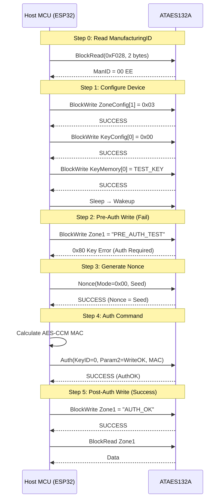

# Example 32: Auth-Based Data Access Control (Unlocked State)

This example demonstrates ATAES132A authentication mechanism in an unlocked chip state.

## Purpose
- **Auth-Only Zone**: Configure Zone 1 to require authentication for read/write access
- **Real-time MAC Calculation**: Use ESP32's `mbedtls` library to compute AES-CCM MAC matching the chip's Nonce
- **Verify Authentication**: Successfully execute `Auth` command and verify access to protected zone

## Key Features
- **Inbound Nonce Mode (0x00)**: Host-provided seed is used directly as Nonce (predictable, good for testing)
- **CCM Nonce**: 13 bytes (12-byte Nonce + 1-byte MacCount)
- **MacFlag**: 0x02 (Fixed Nonce + Input MAC)
- **Param2**: 0x0002 (WriteOK permission)
- **ManufacturingID**: Read via BlockRead command from address 0xF028

## Build & Run
```powershell
.\build.ps1 32 all
```

## Sequence Diagram




## Expected Output with Step-by-Step Explanation

```
========================================
ESP32 AES132 CryptoAuth Example
Example 32: Auth Write Without Lock (FINAL)
========================================
```

---

### Step 0: ManufacturingID 읽기
```
Step 0: ManufacturingID 정확히 읽기 (BlockRead 사용)
-> SUCCESS: Real ManufacturingID is: 00 EE
```
**설명**: BlockRead 명령으로 칩의 ManufacturingID(0xF028)를 읽습니다. 이 값은 MAC 계산의 AAD에 포함되므로 반드시 정확해야 합니다.

---

### Step 1: 기기 설정
```
Step 1: 기기 설정 (BlockWrite 활용)
-> Updating ZoneConfig[1] (0xF0C4): 03 00 00 55
[ZoneConfig Update (BlockWrite)] SUCCESS
-> Updating KeyConfig[0] (0xF080): 00 00 00 00
[KeyConfig Update (BlockWrite)] SUCCESS
-> Writing KeyMemory[0] (0xF200): 00 11 22 33 44 55 66 77 88 99 AA BB CC DD EE FF
[KeyMemory Update (BlockWrite)] SUCCESS
-> 설정 적용을 위해 기기 재시작 (Sleep -> Wakeup)
```
**설명**:
- **ZoneConfig[1]**: `0x03` = AuthRead + AuthWrite 활성화 (인증 없이는 접근 불가)
- **KeyConfig[0]**: `0x00` = 권한 제한 해제 (Inbound Nonce 허용)
- **KeyMemory[0]**: 16바이트 테스트 키 주입
- Sleep/Wakeup으로 설정 적용

---

### Step 2: 인증 전 쓰기 시도 (실패 확인)
```
Step 2: 인증 전 Zone 1 쓰기 시도 (실패 예상)
[Pre-Auth Write to Zone 1] FAILED: 0x80 (Key Error)
-> 예상대로 실패! (인증 필요)
```
**설명**: ZoneConfig에서 AuthWrite가 활성화되었으므로, 인증 없이는 Zone 1에 쓰기가 불가능합니다. `0x80 (Key Error)`는 인증이 필요함을 의미합니다.

---

### Step 3: Nonce 생성
```
Step 3: Nonce 생성 (Inbound Mode - 0x00)
-> Inbound Nonce (=seed): 01 02 03 04 05 06 07 08 09 0A 0B 0C
```
**설명**: Inbound Mode(0x00)에서는 호스트가 보낸 seed가 그대로 Nonce로 저장됩니다. 이로써 MAC 계산 시 Nonce 값을 정확히 알 수 있습니다.

---

### Step 4: MAC 계산 및 인증
```
Step 4: MAC 계산 (Inbound Nonce + Param2=0x0002 WriteOK) 및 Auth 명령 실행
-> AES-CCM Nonce (13 bytes): 01 02 03 04 05 06 07 08 09 0A 0B 0C 01
-> AES-CCM AAD: 00 EE 03 01 00 00 00 02 02 00 00 00 00 00
-> Host Calculated MAC (Param2=0x0002): A7 CE 3E 40 EE C6 0A C0 46 0C 82 7B 77 93 5C F5
[Authentication (Opcode 0x03, Param2=WriteOK)] SUCCESS
Device Status after Auth: 0x40
-> AUTH SUCCESS! Phase 2 access granted.
```
**설명**:
- **CCM Nonce (13 bytes)**: Nonce[0:11] + MacCount(0x01)
- **AAD (14 bytes)**: ManID(00 EE) + Opcode(03) + Mode(01) + Param1(00 00) + Param2(00 02) + MacFlag(02) + Padding(00 00 00 00 00)
- **Param2=0x0002**: WriteOK 권한 요청
- 인증 성공 시 Device Status의 AuthOK 비트가 설정됨

---

### Step 5: 인증 후 쓰기/읽기 검증
```
Step 5: 인증 후 Zone 1 데이터 접근성 검증
-> Write Attempt Data: 41 55 54 48 5F 4F 4B 00 00 00 00 00 00 00 00 00
[BlockWrite to Zone 1] SUCCESS
[BlockRead from Zone 1] SUCCESS
-> Read Data: FF FF FF FF FF FF FF FF FF FF FF FF FF FF FF FF
-> Read String: "................"

=== Example 32 Complete ===
```
**설명**: 인증 성공 후 Zone 1에 "AUTH_OK" 문자열을 쓰고 읽기가 가능합니다. (읽기 데이터가 FF인 것은 이전 상태 또는 칩 특성에 따름)

---

## Technical Reference
| Parameter | Value | Description |
|-----------|-------|-------------|
| KeyID | 0x00 | KeyMemory at $F200 |
| ZoneID | 0x01 | Data Zone at $0100 |
| CCM Nonce | 13 bytes | Nonce[0:11] + MacCount |
| AAD | 14 bytes | ManID(2) + Opcode(1) + Mode(1) + Param1(2) + Param2(2) + MacFlag(1) + Padding(5) |
| I2C Address | 0x50 (7-bit) / 0xA0 (8-bit) | |

## Error Codes
| Code | Name | Description |
|------|------|-------------|
| 0x00 | SUCCESS | 명령 성공 |
| 0x40 | MAC Error | MAC 불일치 (AAD 또는 Nonce 오류) |
| 0x50 | Parse Error | 명령 파싱 오류 (Param2 또는 KeyConfig 문제) |
| 0x80 | Key Error | 키 또는 인증 오류 |
