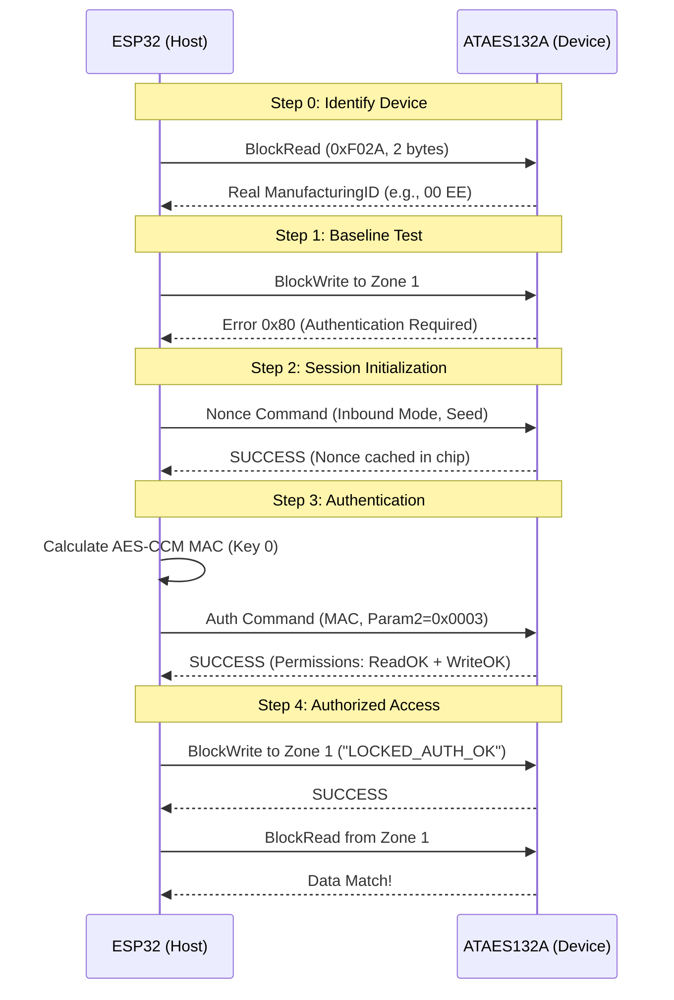

# Example 52: Auth-Based Write (Locked Chip)

This example demonstrates how to perform authenticated write and read operations to a protected data zone (**Zone 1**) using the **Auth** command on a **locked** ATAES132A chip.

## Overview

When the ATAES132A chip is locked (using [Example 99](../99_config_lock)), direct memory access to sensitive zones is restricted. This example shows the standard protocol to gain access:
1.  **Reading ManufacturingID**: Identifying the chip for MAC calculation.
2.  **Nonce Generation**: Initializing the session with an Inbound Nonce.
3.  **Authentication**: Calculating a host-side AES-CCM MAC and submitting it to the chip via the `Auth` command.
4.  **Authorized Access**: Performing `BlockWrite` and `BlockRead` after permissions are granted.

## Technical Details

### AES-CCM Configuration
The ATAES132A uses AES-CCM (Counter with CBC-MAC) for authentication.
-   **Nonce (13 bytes)**: Consists of the 12-byte Nonce (host-provided seed in Inbound mode) + 1-byte `MacCount` (0x01).
-   **AAD (14 bytes)**: Additional Authenticated Data includes `ManID`, `Opcode`, `Mode`, `Param1`, `Param2`, and `MacFlag`.
-   **Inbound Nonce mode**: Used for stable synchronization between Host and Device without requiring additional random number reads.

### Sequence Diagram



## How to Build and Run

1.  **Ensure Device is Locked**: Run `.\build.ps1 99 all` first (if not already locked).
2.  **Clean & Run**:
    ```powershell
    .\build.ps1 52 all
    ```

## Expected Output

```text
========================================
Example 52: Auth-Based Write (Locked Chip)
========================================

Step 0: ManufacturingID 읽기 (BlockRead)
-> SUCCESS: Real ManufacturingID is: 00 EE

Step 1: 인증 전 Zone 1 쓰기 시도 (실패 예상)
[Pre-Auth Write to Zone 1] FAILED: 0x80 (Key Error)
-> 예상대로 실패! (인증 필요)

Step 2: Nonce 생성 (Inbound Mode - 0x00)
-> Inbound Nonce (=seed): 01 02 03 04 05 06 07 08 09 0A 0B 0C

Step 3: MAC 계산 및 Auth 명령 실행
-> Attempting Auth with MASTER_KEY_NEW (0x00...)
-> AES-CCM Nonce (13 bytes): 01 02 03 04 05 06 07 08 09 0A 0B 0C 01
-> AES-CCM AAD: 00 EE 03 01 00 00 00 03 02 00 00 00 00 00
-> Host Calculated MAC: A4 BC 77 BE 8F 51 72 A2 B4 55 5A CA E0 25 74 C1
[Authentication] SUCCESS
Device Status: 0x40
-> AUTH SUCCESS! Read+Write access granted.

Step 4: 인증 후 Zone 1 쓰기/읽기 검증
-> Write Data: 4C 4F 43 4B 45 44 5F 41 55 54 48 5F 4F 4B 00 00
[BlockWrite to Zone 1] SUCCESS
[BlockRead from Zone 1] SUCCESS
-> Read Data: 4C 4F 43 4B 45 44 5F 41 55 54 48 5F 4F 4B 00 00
-> Read String: "LOCKED_AUTH_OK.."
-> DATA VERIFIED: Write/Read match!

=== Example 52 Complete ===
```

## Troubleshooting

| Error Code | Meaning | Possible Cause |
| :--- | :--- | :--- |
| **0x40** | MAC Error | Master key mismatch, incorrect `ManID`, or invalid AAD/Nonce construction. |
| **0x80** | Key Error | Permission denied. Authentication has not been performed or failed. |
| **0xC0** | Device Error | I2C communication issue or device is not in a ready state. |
